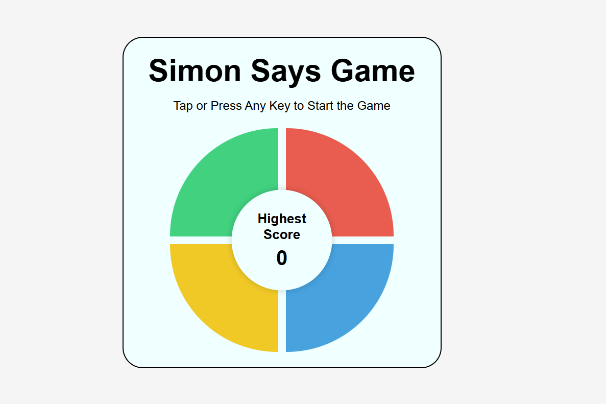
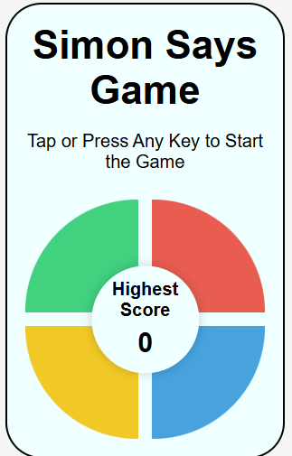

# 🎮 Simon Says Game

A fun and interactive **Simon Says Memory Game** built using **HTML, CSS, and JavaScript**.

The game tests your memory by generating an increasingly difficult color sequence that the player must repeat correctly.

---

# 🚀 Live Demo Simon Says App

🔗 [https://simon-says-game-by-rituraj.netlify.app/](https://simon-says-game-by-rituraj.netlify.app/)

---

# 📹 Demo Video

[Download Demo Video](./assets/demo-video.mp4)

OR

[https://github.com/user-attachments/assets/add-your-video-link-here](https://github.com/user-attachments/assets/demo-asset.mp4)

> Upload your screen recording video on GitHub and paste the generated link above.

---

# ✨ Features

## 🎯 Gameplay Features

✔️ Random color sequence generation
✔️ Level progression system
✔️ Memory-based gameplay
✔️ High score tracking
✔️ Game over detection
✔️ Restart support

---

## 💻 Technical Features

✔️ Responsive design for mobile and desktop
✔️ Interactive button animations
✔️ Keyboard support
✔️ Mobile touch support
✔️ Dynamic DOM manipulation
✔️ Clean UI with smooth effects

---

# 📸 Screenshots

## 🖥️ Desktop View



---

## 📱 Mobile View



---

# 🛠️ Tech Stack

* HTML5
* CSS3
* JavaScript (ES6)

---

# 🧠 How the Game Works

1. Press any key or tap the screen to start.
2. The game flashes a random color.
3. Repeat the same sequence by clicking the buttons.
4. Each level adds one new color to the sequence.
5. If you press the wrong button, the game ends.
6. Try to beat your highest score 🚀

---

# 📂 Project Structure

```bash
Simon-Says-Game/
│
├── index.html
├── style.css
├── app.js
│
├── assets/
│   ├── desktop-view.png
│   ├── mobile-view.png
│   └── demo-video.mp4
```

---

# ⚡ Installation

## 1️⃣ Clone Repository

```bash
git clone https://github.com/Ritu-Raj64/simon-says-game.git
```

---

## 2️⃣ Open Project Folder

```bash
cd simon-says-game
```

---

## 3️⃣ Run the Project

Open `index.html` in your browser.

OR

Use the **Live Server** extension in VS Code.

---

# 💡 What I Learned

* Handling game logic using JavaScript
* DOM manipulation and event handling
* Managing arrays and sequences
* Responsive web design
* Game state management
* Improving UI/UX interactions

---

# 🎯 Future Improvements

* Add sound effects 🎵
* Add difficulty modes 🔥
* Add dark/light themes 🌙
* Store high scores using localStorage 💾
* Replay full sequence animation 🎮

---

# 🌐 Connect With Me

## GitHub

[https://github.com/Ritu-Raj64](https://github.com/Ritu-Raj64)

## LinkedIn

[https://www.linkedin.com/in/ritu-raj64/](https://www.linkedin.com/in/ritu-raj64/)

---

